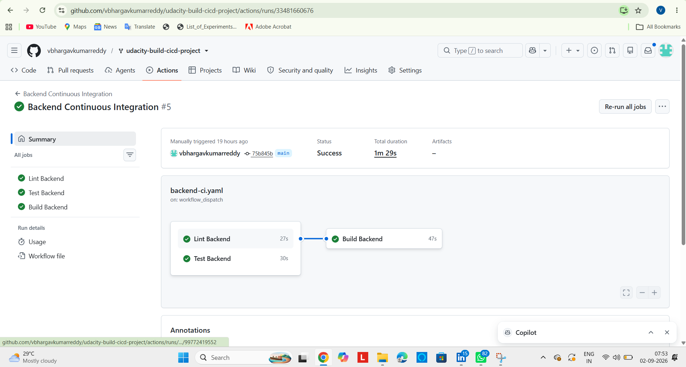
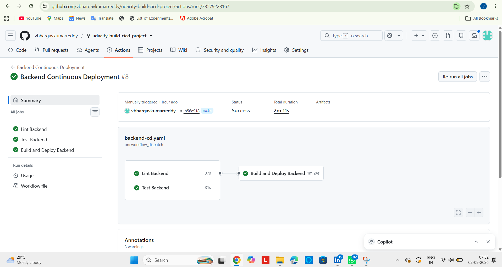
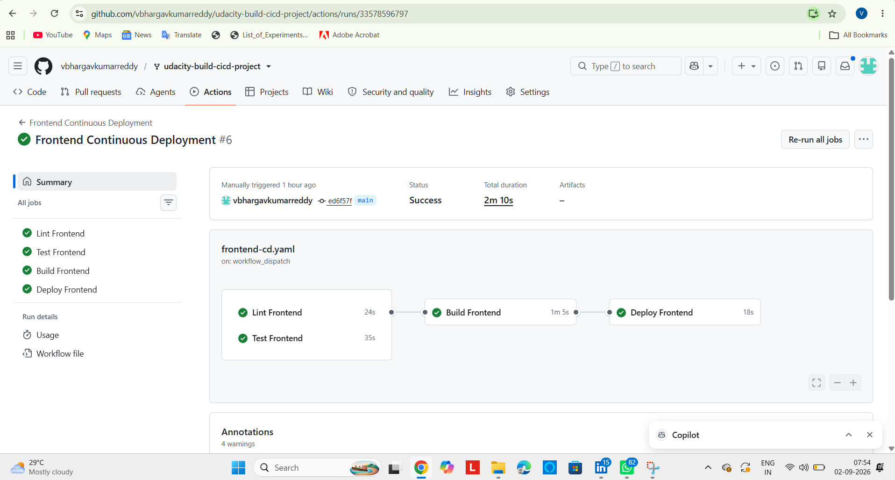
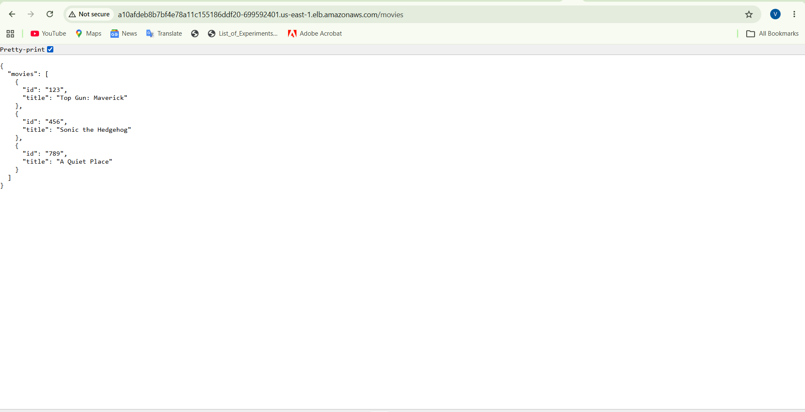
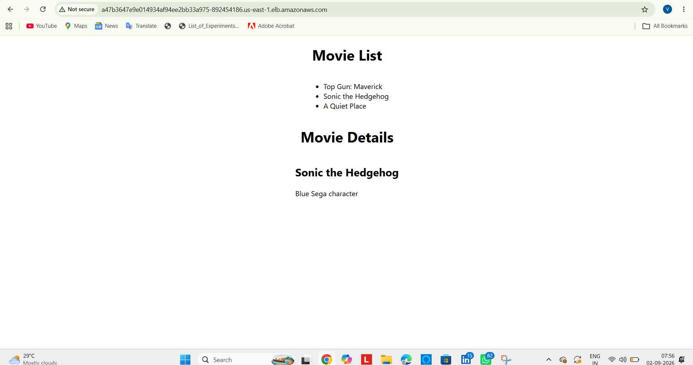

# Submission Evidence

## GitHub Repository

https://github.com/vbhargavkumarreddy/udacity-build-cicd-project

## Live Application URLs

- **Frontend:** http://a47b3647e9e014934af94ee2bb33a975-892454186.us-east-1.elb.amazonaws.com
- **Backend /movies:** http://a10afdeb8b7bf4e78a11c155186ddf20-699592401.us-east-1.elb.amazonaws.com/movies

## GitHub Actions — Successful Runs

### Backend Continuous Integration

### Backend Continuous Deployment

### Frontend Continuous Integration

### Frontend Continuous Deployment

## Application Evidence

### Backend Application

### Frontend Application

